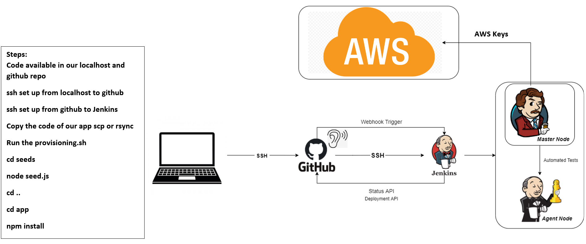

# Jenkins CI/CD


## Creating a new job in Jenkins
- Click on `New Item`
- Enter appropriate item name and choose `freestyle project`
- Add description about the job
- Click `Discard old builds` and put 3 in `Max # of builds to keep`
- Click `Add build step` and `Execute shell` 
- Write in necessary code, apply and save
- Build job to see if it is successful
- If you have another job to execute after this choose `add post build action`
- Choose `build other projects` and add the project to build

## Check build
- Click on the job and choose `build now`
- Navigate to build history and choose your build
- Click the drop down and choose console output to check if the build was successful or failed

## Creating a webhook
- On the relevant GitHub repo click on settings -> webhook and create a webhook
- Name the webhook and the URL is `http://JENKINSIP:PORT/github-webhook/` make sure deploy key is read/write

## Connecting public key to GitHub
- Copy public key from .ssh directory `cat jenkins.pub`
- In GitHub navigate to `settings`, `deploy keys` and add the key with read/write access

## Connecting private key
- Create a job like above
- Choose git and add in HTTP for the repo
- Office 365 connector restrict project `sparta-ubunut-node`
- Navigate to Source code management, git, copy and paste `SSH URL from GitHub repo to jenkins`
- Add the private key choosing `SSH username with private key` with the username eng89saim
- Copy and paste jenkins private key from the SSH folder including all the text

## Jenkins pipeline and GitHub
- Change branches to build to `*/main`
- Tick `GitHub hook trigger for GITScm polling`
- Tick `Provide Node & npm bin/ folder to PATH`
- Choose `build execute shell` and enter 
  ```
  cd app 
  npm install  
  npm test
  ```
- Save and check the build by clicking `BUILD NOW`